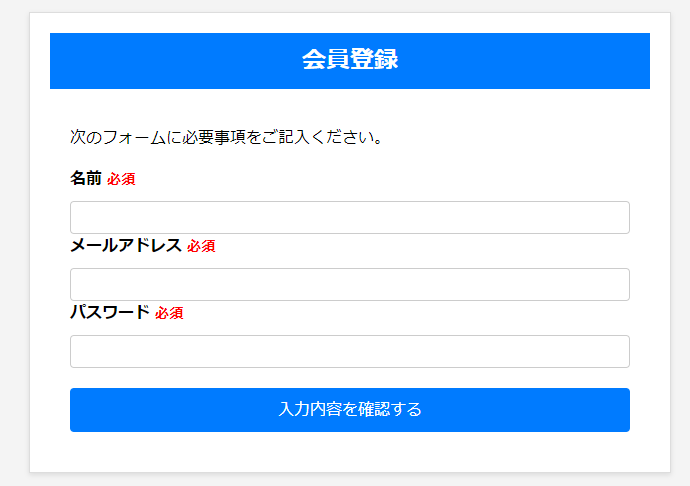

# 野菜掲示板
このサイトは地域の農家の方や買い手の方が野菜の販売状況を共有できるサイトです 

使用技術　概要
<h3>BE
  
<h3>DB
mariadb
</a> 
 
  
実家が農家で地元のスーパーや道の駅で野菜を出品するさいに情報が共有しずらいという問題を解決するため 
作成しました。ログインさえすれば誰でも扱え簡単で使いやすいサイトを目指しました 
セキュリティ面を意識して安心して使えるように力を入れました 

### 1.新規登録機能
掲示板を使用するためのアカウント登録機能. 
名前・メールアドレス・パスワードの項目があり入力が適切でなければエラーがでるように. 
メールアドレスは既に登録済みであればエラーが表示されパスワードも適切な文字数でなければエラーがでるように. 

### 2.ログイン機能
掲示板を使用するためのログイン機能. 
正しいメールアドレスとパスワードを使用しないとエラーが表示される. 
ログインしていなければ投稿機能・削除機能・いいね機能などの主要な機能が使えない. 

### 3.検索機能
投稿されている内容を検索できる機能. 
タイトルと投稿内容を検索して一致しているものがあれば表示できる. 

### 4.削除機能
投稿を削除できる機能. 
ログインしているかつその投稿をしたユーザーのみが投稿を削除できる機能 
誰でも削除できるわけではなく投稿した本人のみ削除可能. 

### 5.詳細機能
画像と投稿日時から詳細をみることができる. 

### 6.いいね機能
投稿にいいねする機能. 
ログインしているユーザーのみ使用可能で同じフォームには1ユーザー1度のみいいねが使用可能. 

### 7.ページネーション機能
投稿内容が多くなればページを分割する機能. 
5投稿以上になれば自動的に次のページがつくられ移動することが可能. 

