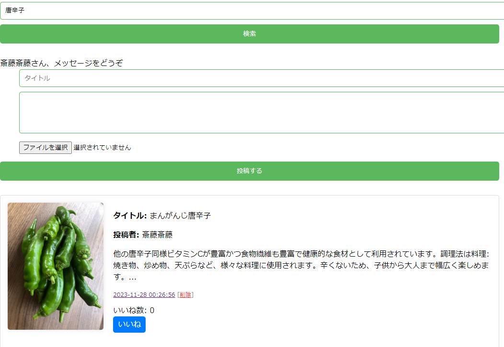

# 野菜掲示板
このサイトは地域の農家の方や買い手の方が野菜の販売状況を共有できるサイトです 

## 作った理由
実家が農家で地元のスーパーや道の駅で野菜を出品する際に情報が共有しずらいという問題を解決するため 
作成しました。ログインさえすれば誰でも扱えるように簡単で使いやすいサイトを目指しました 
セキュリティ面を意識して安心して使えるように力を入れました 

## 製作期間
個人開発で1か月 

## 使用技術
<h3>BE
  
<h3>DB
mariadb
</a> 
 

## 苦労したこと、乗り越えた背景
データベース操作の複雑さ 
データベースとのやり取りは多くのデータを扱う際大変でした 
セキュリティの問題 
SQLインジェクション対策　PDOとプリペアドステートメントを使用 
XSS（クロスサイトスクリプティング）攻撃対策: htmlspecialchars() を使用して特殊文字をエスケープし、XSS攻撃を防止 
セッション固定攻撃対策:セッションIDを定期的に再生成してセッション固定攻撃を防止 
web開発をするうえで初めて経験するセキュリティの面に苦労した。 
動画教材を使う、webサイトを参考にするなどのインプットで知識基礎を付けたうえで実装した 
実装するなかでもわからないことは多くエラーがでた際はコードを読み返したり同じ事例をネットで調べたりしもう一度書いてみるなど試行錯誤した 

## 機能

### 1.新規登録機能
掲示板を使用するためのアカウント登録機能. 
名前・メールアドレス・パスワードの項目があり入力が確認される. 
メールアドレスは既に登録済みであればエラーが表示されパスワードも適切な文字数でなければエラーが表示. 

### 2.ログイン機能
掲示板を使用するためのログイン機能. 
正しいメールアドレスとパスワードを使用しないとエラーが表示. 
ログインしていなければ投稿機能・削除機能・いいね機能などの主要な機能が使えない. 

### 3.検索機能
投稿されている内容を検索できる機能. 
タイトルと投稿内容を検索して一致しているものがあれば表示できる. 

### 4.削除機能
投稿を削除できる機能. 
ログインしているかつその投稿をしたユーザーのみが投稿を削除できる機能. 
誰でも削除できるわけではなく投稿した本人のみ削除可能. 

### 5.詳細機能
画像と投稿日時から詳細をみることができる. 

### 6.いいね機能
投稿にいいねする機能. 
ログインしているユーザーのみ使用可能で同じフォームには1ユーザー1度のみいいねが使用可能. 

### 7.ページネーション機能
投稿内容が多くなればページを分割する機能. 
5投稿以上になれば自動的に次のページがつくられ移動することが可能. 

### 8.セキュリティ対策
1.セッションベースの認証:ユーザーのログイン状態はセッション変数を通じて追跡されログイン状態が確認される 
2.セッション固定攻撃対策:セッションIDを定期的に再生成してセッション固定攻撃を防止 
3.クロスサイトスクリプティング（XSS）対策:htmlspecialchars() を使用して特殊文字をエスケープし、XSS攻撃を防止 
4.データベースインジェクション対策:PDOとプリペアドステートメントを使用し、SQLインジェクション攻撃を防止 
　ユーザー入力はプレースホルダーにバインドされ、直接クエリに含まれない 
5.ファイルアップロードのバリデーション:アップロードされたファイルのサイズと形式をチェックし不正なファイルのアップロードを防止 
6.エラーメッセージの管理:エラーメッセージは配列に格納されユーザーに表示されこれによりエラー発生時の詳細情報が不適切に露出するのを防止 
7.HTTPSの使用:データの安全な伝送のためにHTTPSプロトコルを使用して通信を暗号化 
これらのセキュリティ対策を実施して安全性を高めました 
